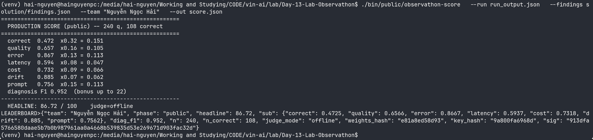
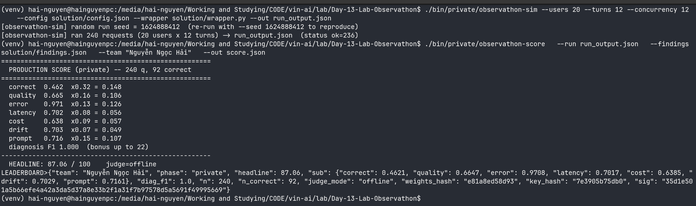

# Báo cáo ngắn - Observathon

## 1) Giai đoạn practice: vấn đề ban đầu

- Ở giai đoạn đầu, nhóm gặp lỗi chạy/chấm trên dữ liệu `practice`, dẫn đến kết quả chấm `public` bị `n = 0`.
- Dấu hiệu nhận biết là `run_output.json` có `phase: "practice"` và `qid` dạng `prac-*`.
- Khi đó các trục điểm chính (`correct`, `quality`, `error`, `prompt`) gần như không được chấm đúng dữ liệu mục tiêu.

---

## 2) Tối ưu phần `solution` để chạy public đạt điểm cao

Nhóm đã tối ưu trực tiếp trong thư mục `solution/` theo 3 hướng:

- **Tối ưu cấu hình (`solution/config.json`)**
  - Giảm độ ngẫu nhiên và độ trễ (nhiệt độ thấp, context gọn, số bước hợp lý).
  - Bật `retry` + `backoff` để giảm lỗi kết nối/tool.
  - Bật `cache`, `normalize_unicode`, `redact_pii`, `verify`, và giới hạn `tool_budget`.

- **Viết lại prompt (`solution/prompt.txt`)**
  - Cố định thứ tự gọi tool và nguyên tắc grounding theo dữ liệu tool.
  - Ràng buộc công thức tính tổng chính xác.
  - Bổ sung chống prompt injection từ phần `GHI CHU`.
  - Chuẩn hóa output với dòng kết thúc `Tong cong: <integer> VND` khi đủ dữ liệu.

- **Gia cố wrapper (`solution/wrapper.py`)**
  - Làm sạch input, ẩn PII trong output.
  - Retry/cache an toàn cho chạy song song.
  - Hậu kiểm và chuẩn hóa câu trả lời để giảm lỗi số học/định dạng.

Kết quả sau tối ưu: điểm `public` tăng rõ rệt.

**Evidence (public):**

---

## 3) Kết quả sau khi test private

Theo `score.json` hiện tại:

- `phase`: `private`
- `headline`: **87.06**
- `n`: `240`, `n_correct`: `92`
- Thành phần điểm:
  - `correct`: 0.4621
  - `quality`: 0.6647
  - `error`: 0.9708
  - `latency`: 0.7017
  - `cost`: 0.6385
  - `drift`: 0.7029
  - `prompt`: 0.7161
  - `diag_f1`: 1.0

**Evidence (private):**

---

## Kết luận

Sau quá trình tối ưu `config + prompt + wrapper`, hệ thống đã chuyển từ trạng thái chạy/chấm sai tập dữ liệu (practice) sang chạy đúng pipeline và đạt điểm cao, ổn định trên private (**87.06**).
